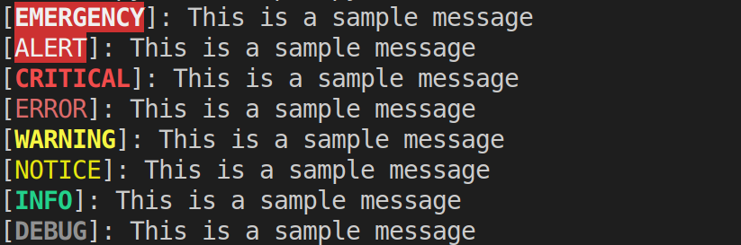
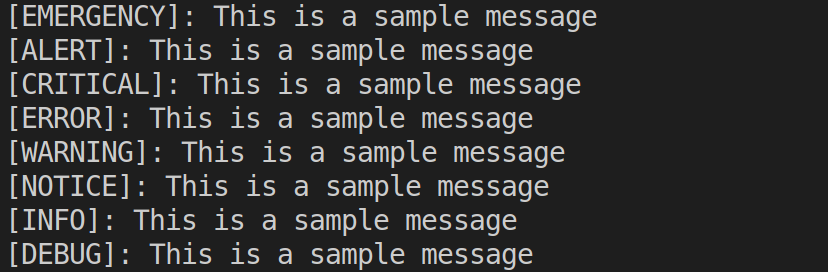

# Overview

It is an utility library which allow you to use a common interface accross all its component
to log messages with different levels.

## Logging levels

It use the standard logging levels widely used on all systems:

| # | Levels |
|---|---|
| 0 | EMERGENCY |
| 1 | ALERT |
| 2 | CRITICAL |
| 3 | ERROR |
| 4 | WARNING |
| 5 | NOTICE |
| 6 | INFO |
| 7 | DEBUG |

## Installation

TODO

## Logging components

| Type | Status | Description |
|---|---|---|
| [CLILogger](### CLI Logger) | Available | It outputs logging messsages to STDOUT |
| FileLogger | Planned | It will outputs logging messages directly to file |

### CLI Logger

This logging components allow you to outputs logging information and raises and exception from critical level and above.

#### Usage

```python
# Import the dependency
from clagiordano.python3_logger.CLILogger import CLILogger

# Init the component
logger = CLILogger()

# Use it to log something
logger.info("Sample info message")
logger.error("Sample error message")
logger.critical("Sample critical message")
```

Ad default it uses ANSI colors but you can toggle the ansi flag but you can easily toggle off this feature using the following code:

```python
logger.set_ansi(False)
```

#### Sample ANSI output (default)



#### Sample ANSI OFF output



## Contributing

Please read [CONTRIBUTING.md](https://gist.github.com/PurpleBooth/b24679402957c63ec426) for details on our code of conduct, and the process for submitting pull requests to us.

## Versioning

We use [SemVer](http://semver.org/) for versioning. For the versions available, see the releases on this repository.

## Authors

* **Claudio Giordano** - *Initial work* - [clagiordano](https://github.com/clagiordano)

See also the list of [contributors](CONTRIBUTORS.md) who participated in this project.
